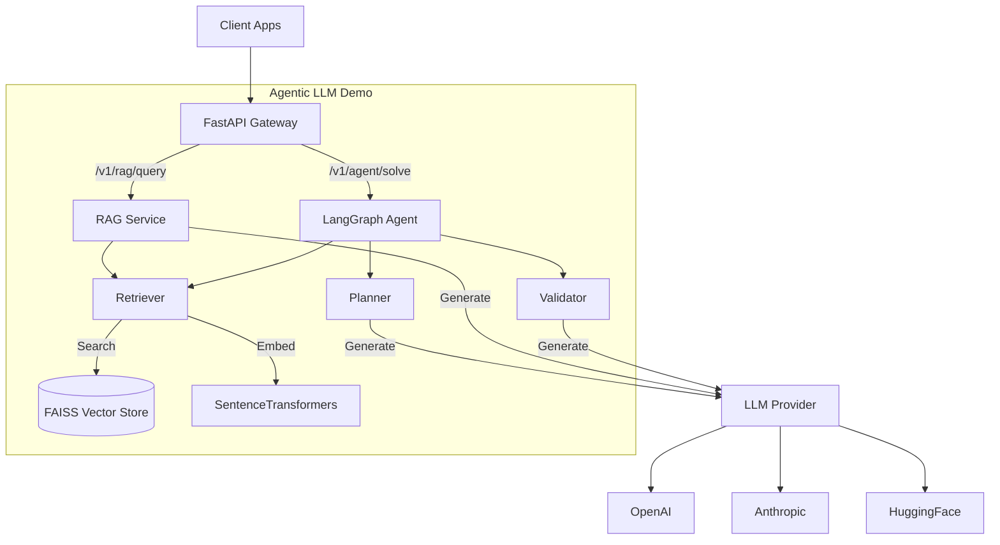

# Agentic LLM Demo

A production-leaning scaffold for demonstrating **RAG (Retrieval-Augmented Generation)** and **Agentic Workflow** capabilities using Python, FastAPI, and LangGraph.

Designed for interviews, PoCs, and stakeholder demonstrations, this project showcases traceability, testability, and portability in building LLM-powered applications.

---

## 🚀 Key Features

*   **Dual-Mode API**:
    *   `/v1/rag/query`: Fast, citation-backed RAG for direct question answering.
    *   `/v1/agent/solve`: Multi-step reasoning agent (Plan → Retrieve → Answer → Validate) using LangGraph.
*   **System Observability**: Integrated `/v1/rag/status` and `/health` endpoints for real-time system monitoring.
*   **Traceability**: Every answer includes precise citations with similarity scores and links to source document chunks.
*   **Provider Agnostic**: Switch between OpenAI, Anthropic, and HuggingFace models via environment variables.
*   **Local-First**: Default setup uses local embeddings (SentenceTransformers) and vector store (FAISS) for zero-cost operation.
*   **Production Ready**: Includes Pydantic validation (with OpenAPI examples), structured logging, CORS support, and global exception handling.

## 🏗️ Architecture



## 🛠️ Tech Stack

*   **Runtime**: Python 3.11+
*   **API**: FastAPI, Uvicorn
*   **Orchestration**: LangGraph, LangChain
*   **Vector Store**: FAISS (Local)
*   **Embeddings**: SentenceTransformers (all-MiniLM-L6-v2)
*   **Validation**: Pydantic v2
*   **Deployment**: Docker, Docker Compose

## ⚡ Quickstart

### Prerequisites

*   Python 3.11 or higher
*   Git

### Local Setup

1.  **Clone the repository**
    ```bash
    git clone https://github.com/skydeamon/agentic-rag-llm-demo.git
    cd agentic-rag-llm-demo
    ```

2.  **Set up environment**
    ```bash
    python -m venv .venv
    source .venv/bin/activate  # Windows: .venv\Scripts\activate
    pip install -r requirements.txt
    ```

3.  **Configure Environment**
    Copy the example configuration and set your API keys.
    ```bash
    cp .env.example .env
    # Edit .env to add your OPENAI_API_KEY, ANTHROPIC_API_KEY, etc.
    ```

4.  **Ingest Documents**
    Load sample documents into the local vector store.
    ```bash
    bash scripts/ingest.sh
    ```

5.  **Run the API**
    Start the development server.
    ```bash
    bash scripts/dev_run.sh
    ```
    The API will be available at [http://localhost:8000](http://localhost:8000).

6.  **Explore Documentation**
    Visit [http://localhost:8000/docs](http://localhost:8000/docs) to test endpoints interactively via Swagger UI.

### Docker Setup

1.  **Build the image**
    ```bash
    docker build -t agentic-llm-demo -f docker/Dockerfile .
    ```

2.  **Run the container**
    ```bash
    docker run --rm -p 8000:8000 --env-file .env agentic-llm-demo
    ```

## 📂 Project Structure

```
agentic-rag-llm-demo/
├── app/
│   ├── main.py              # FastAPI application entry point
│   ├── api/                 # Endpoint routers (rag, agent, status)
│   ├── rag/                 # RAG logic (ingestion, retrieval)
│   ├── agent/               # LangGraph agent definitions
│   ├── llm/                 # LLM provider abstraction and prompts
│   └── models.py            # Centralized Pydantic models
├── data/
│   └── sample_docs/         # Source documents for ingestion
├── scripts/                 # Utility scripts (ingest, dev_run, benchmarks)
├── tests/                   # Unit and integration tests
├── .env.example             # Environment variable template
├── requirements.txt         # Python dependencies
└── README.md                # Project documentation
```

## 🔧 Configuration

The application is configured using environment variables in the `.env` file.

| Variable | Description | Default |
| :--- | :--- | :--- |
| `PROVIDER` | LLM Provider to use (`openai`, `anthropic`, `huggingface`) | `openai` |
| `MODEL_NAME` | Model identifier (e.g., `gpt-4o-mini`, `claude-3-opus`) | `gpt-4o-mini` |
| `OPENAI_API_KEY` | API Key for OpenAI | - |
| `ANTHROPIC_API_KEY` | API Key for Anthropic | - |
| `EMBEDDINGS_MODEL` | HuggingFace model for local embeddings | `all-MiniLM-L6-v2` |
| `VECTOR_STORE_PATH` | Path to persist FAISS index | `.vector_store/faiss` |

## 🧪 Testing

Run the test suite to ensure everything is working correctly.

```bash
# Run all tests
PYTHONPATH=. pytest

# Run unit tests
PYTHONPATH=. pytest tests/unit/

# Run integration tests
PYTHONPATH=. pytest tests/integration/
```

## 🛡️ License

MIT License. See `LICENSE` for details.
